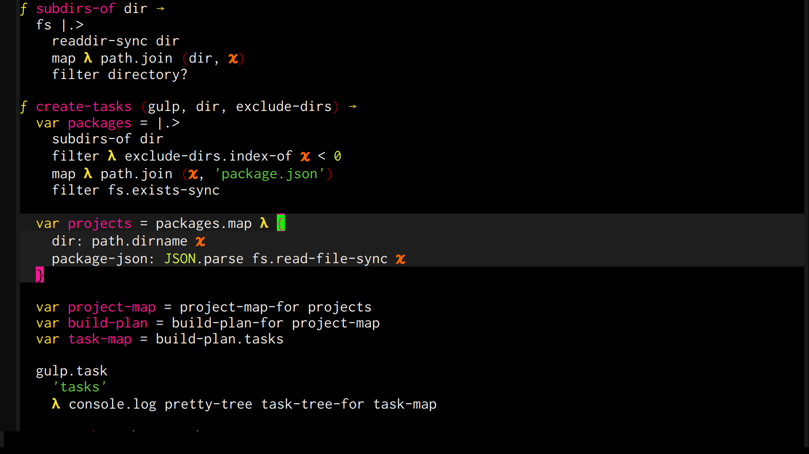

## Metascript Live Pack

A hackable [Metascript](https://github.com/massimiliano-mantione/metascript) language mode packaged for [emacs-live](http://overtone.github.io/emacs-live).



## Features

1. syntax highlighting with support for nice rendering of lambdas and other constructs
2. flymake integration for checking compilation errors as you type (requires [mjs-check](https://github.com/bamboo/mjs-check) as a dev dependency)
3. simple auto indentation
4. code evaluation and a repl
5. npm test integration with stack trace navigation

## Keyboard shortcuts

* <kbd>M-x mjs-repl</kbd>: Launch a repl.

### mjs buffer

Keyboard shortcut                    | Description
-------------------------------------|-------------------------------
<kbd>C-M-f</kbd> | Move to the next block.
<kbd>C-M-b</kbd> | Move to the previous block.
<kbd>C-M-Space</kbd> | Mark the next block.
<kbd>C-M-x</kbd> | Evaluate active region. Definitions become available in the repl.
<kbd>C-c,</kbd>  | Run the tests.

### mjs test buffer

Usual [compilation-minor-mode](https://www.gnu.org/software/emacs/manual/html_node/emacs/Compilation-Mode.html) shortcuts.

## Installation

git clone into your ~/.live-packs directory and add
```lisp
(live-add-packs '(~/.live-packs/mjs-pack))
```
to your ~/.emacs-live.el

## Configuration

M-x customize-group mjs-mode

 Have fun!
